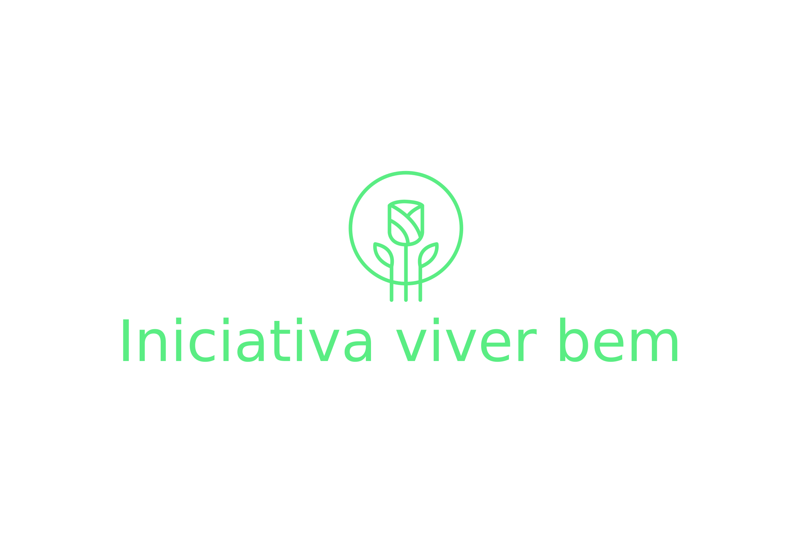
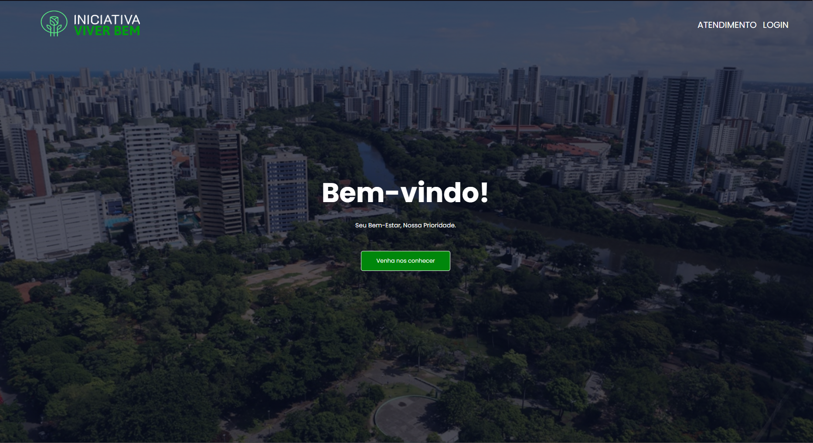

# Iniciativa Viver Bem
 

# Sobre o projeto
 

É uma aplicação web desenvolvida em HTML, CSS e Javascript com integração ao banco dados Firebase, onde são armazenados os dados de consultas e credenciais de acesso dos usuários.

Consiste em um Website que os pacientes podem realizar agendamento de consultas com o nosso cliente, e o mesmo, recebe a solicitação de consulta no email, onde poderá responder de forma prática, rápida e com mais conforto.

Acesso ao projeto: [Website](https://iniciativa-viver-bem.vercel.app)

# Layout Web
 

# Funcionalidades do projeto
- [X] Cadastro de consultas

- [X]  Intregação com banco de dados

- [X] Consultas integradas ao e-mail

# Tecnologias utilizadas 
## Front-End
- HTML / CSS / Javascript
## Back-End
- Javascript
## Implantação em produção
- Hospedadem: Vercel
- Banco de dados: Firebase
- API: FormSubmit
  
# Autores
- Pedro Henrique dos Santos Ewen - [Linkedin](https://www.linkedin.com/in/pedroewen-sec/) | [Github](https://github.com/PedroEwen)
- Samuel Lima Castilho Jr. - [Linkedin](https://www.linkedin.com/in/samuel-lima-51ba64276/) | [Github](https://github.com/SamuelJRL)
- Pablo Thiago Melo - [Linkedin](https://www.linkedin.com/in/pablo-thiago/) | [Github](https://github.com/PThiago1)

# Próximos passos
- [ ]  Login

- [ ] Tela de gerenciamento
